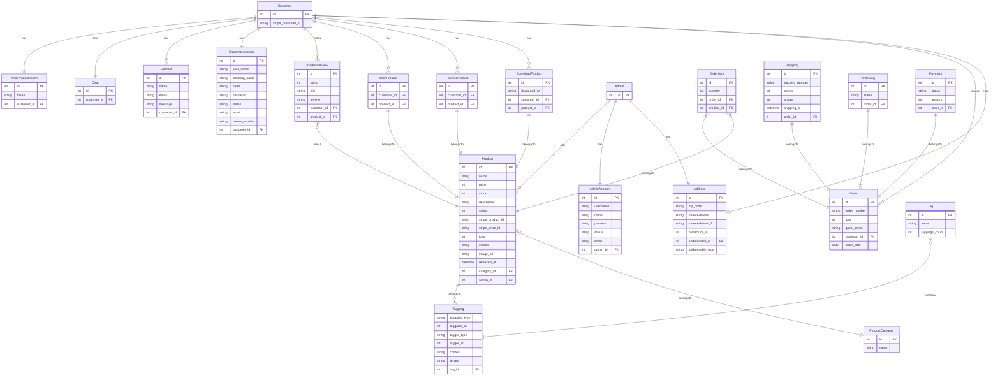

```mermaid
erDiagram
    Customer ||--|| Address: has
    Customer ||--o{ Order: places
    Customer ||--o{ DownloadProduct: has
    Customer ||--o{ FavoriteProduct: has
    Customer ||--o{ WishProduct: has
    Customer ||--o{ ProductReview: writes
    Customer ||--|| CustomerAccount: has
    Customer ||--o{ Contact: has
    Customer ||--|| Chat: has
    Customer ||--|| WishProductToken: has
    Customer{
        int id PK
        string stripe_customer_id
    }

    Contact{
        int id PK
        string name
        string email
        string message
        int customer_id FK
    }

    CustomerAccount{
        int id PK
        string user_name
        string shipping_name
        string name
        string password
        string status
        string email
        string phone_number
        int customer_id FK
    }

    Admin ||--|| Address: has
    Admin ||--|| AdminAccount: has
    Admin ||--o{ Product: add

    Admin{
        int id PK
    }

    AdminAccount{
        int id PK
        string userName
        string name
        string password
        string status
        string email
        int admin_id FK
    }

    Address{
        int id PK
        string zip_code
        string streetAddress
        string streetAddress_2
        int prefecture_id
        int addressable_id FK
        string addressable_type
    }


    Product |{--|| ProductCategory: belongsTo
    Product ||--o{ Tagging: belongsTo

    Product{
        int id PK
        string name
        int price
        int stock
        string description
　　　　　　　　　　　　　　　　%% statusはenumなのでint型　{ draft:0, published:1, archived:2, trashed:3 }
        int status
        string stripe_product_id
        string stripe_price_id
        %% { analog: 0, digital: 1}
        int type
        string creator
        string image_url
        datetime released_at
        int category_id FK
        int admin_id FK
    }

    OrderItem |{--|| Product: belongsTo
    OrderItem |{--|| Order: belongsTo
    OrderItem{
        int id PK
        int quantity
        int order_id FK
        int product_id FK
    }

    Order{
        int id PK
        string order_number
        int total
        string guest_email
        int customer_id FK
        date order_date
    }

    Shipping ||--|| Order: belongsTo
    Shipping{
        int id PK
        string tracking_number
        int carrier
        int status
        datetime shipping_at
        it order_id FK
    }

    ProductCategory{
        int id PK
        string name
    }

    OrderLog ||--|{ Order: belongsTo
    OrderLog{
        int id PK
        string status
        int order_id FK
    }

    ProductReview }o--|| Product: about
    ProductReview{
        int id PK
        int rating
        string title
        string review
        int customer_id FK
        int product_id FK
    }

    DownloadProduct ||--|| Product: belongsTo
    DownloadProduct{
        int id PK
        string download_url
        int customer_id FK
        int product_id FK
    }

    FavoriteProduct ||--|| Product: belongsTo
    FavoriteProduct{
        int id PK
        int customer_id FK
        int product_id FK
    }

    WishProduct ||--|| Product: belongsTo
    WishProduct{
        int id PK
        int customer_id FK
        int product_id FK
    }

    WishProductToken{
        int id PK
        string token
        int customer_id FK
    }

    Payment ||--|| Order: belongsTo
    Payment{
        int id PK
        string status
        int amount
        int order_id FK
    }

    Tag o{--|| Tagging: hasMany

    Tag{
        int id PK
        string name
        int taggings_count
    }

    Tagging{
        string taggable_type
        int taggable_id
        string tagger_type
        int tagger_id
        string context
        string tenant
        int tag_id FK
    }

    Chat{
        int id PK
        int customer_id FK
    }


```
