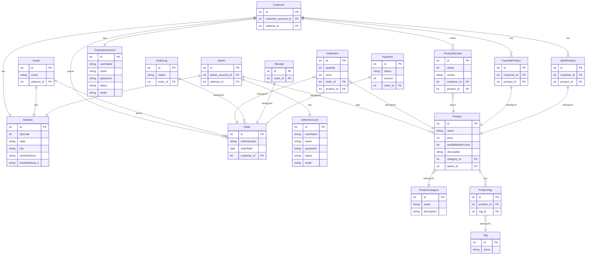

```mermaid
erDiagram
    Customer ||--|| Address: has
    Customer ||--o{ Order: places
    Customer ||--o{ FavoriteProduct: has
    Customer ||--o{ WishProduct: has
    Customer ||--o{ ProductReview: writes
    Customer ||--|| CustomerAccount: has

    Customer{
        int id PK
        int customer_account_id FK
        int address_id FK
    }

    Guest ||--|| Address: has
    Guest ||--|{ Order: places
    Guest{
        int id PK
        string email 
        int address_id FK
    }

    CustomerAccount{
        int id PK
        string userName
        string name
        string password
        string status
        string email
    }

    Admin ||--|| Address: has
    Admin ||--|| AdminAccount: has
    Admin ||--o{ Product: add

    Admin{
        int id PK
        int admin_account_id FK
        int address_id FK
    }

    AdminAccount{
        int id PK
        string userName
        string name
        string password
        string status
        string email
    }

    Address{
        int id PK
        int zipCode
        string state
        string city
        string streetAddress
        string streetAddress_2
    }


    Product |{--|| ProductCategory: belongsTo
    Product ||--o{ ProductTag: has

    Product{
        int id PK
        string name
        int price
        int availableItemCount
        string description
        int category_id FK
        int admin_id FK
    }

    OrderItem |{--|| Product: belongsTo
    OrderItem |{--|| Order: belongsTo
    OrderItem{
        int id PK
        int quantity
        int price
        int order_id FK
        int product_id FK
    }

    Order{
        int id PK
        string orderNumber
        date orderDate
        int customer_id FK
    }

    ProductCategory{
        int id PK
        string name
        string description
    }

    OrderLog ||--|{ Order: belongsTo
    OrderLog{
        int id PK
        string status
        int order_id FK
    }

    Receipt ||--|| Order: belongsTo
    Receipt{
        int id PK
        int order_id FK
    }

    ProductReview }o--|| Product: about
    ProductReview{
        int id PK
        int rating
        string review
        int customer_id FK
        int product_id FK
    }

    FavoriteProduct ||--|| Product: belongsTo
    FavoriteProduct{
        int id PK
        int customer_id FK
        int product_id FK
    }

    WishProduct ||--|| Product: belongsTo
    WishProduct{
        int id PK
        int customer_id FK
        int product_id FK
    }

    Payment ||--|| Order: belongsTo
    Payment{
        int id PK
        string status
        int amount
        int order_id FK
    }

    Tag{
        int id PK
        string name 
    }

    ProductTag o{--|| Tag: belongsTo 
    ProductTag{
        int id PK
        int product_id FK
        int tag_id FK
    }

```
